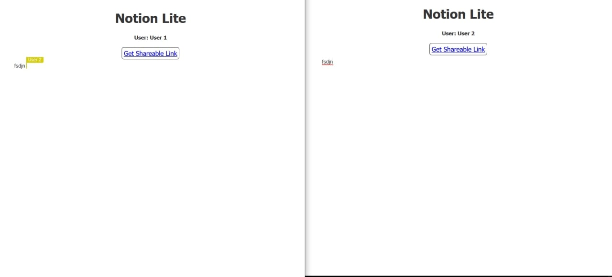

# Notion Lite - A Real Time Collaborative Text Editor

# Introduction

Collaborative text editors allow for remote text editing of the same document by multiple users.

# Demo
Sample Demo

# Technologies used

We used the following technologies and concepts to implement our project:
1.  Conflict-free Replicated Data Types (CRDTs)
2.  WebRTC
3.  ReactJS

# CRDTs

A Conflict-free Replicated Data Type (CRDT) is a data structure that simplifies distributed data storage systems and multi-user applications. It helps in many applications, particularly those in the area of collaborative software (such as Google Docs), where conflict resolution is important.

# WebRTC

WebRTC allows us to use Real Time Communication (RTC) in a direct peer-to-peer mode through the use of APIs.

# ReactJS

We use ReactJS to build the website for our collaborative text editor.

# Link to detailed report

This is just a basic report introducing the technologies used in our project. For the full report please view this link:

https://drive.google.com/drive/folders/1fAvharMCSzNCvUKTVXZ7AxckhmCTwFW7?usp=sharing
